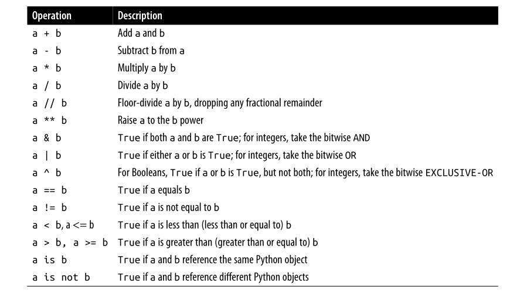
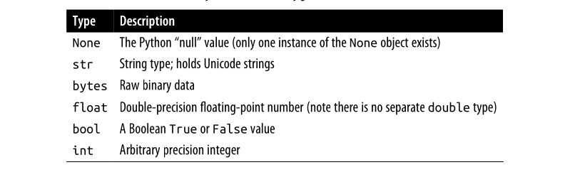

# Data Analysis

## Instalación
- Instalar usando Conda o manualmente.

Descargar `Anaconda3-latest-linux-x86_64.sh` e instalar `bash Anaconda3-2025.06-0-Linux-x86_64.sh`.
Definir `conda-forge` como canal de paquetes por defecto:

```bash
conda config --add channels conda-forge
conda config --set channel_priority strict
```

- Crear un entorno virtual:

```bash
conda create -y -n {name-environment} python=3.xx
# activar entorno virtual
conda activate {name-environment}
```

- Actualizar entornos en conda:

```bash
conda update --{update-all|all} -n {base|other_name}
```

- Instalar los paquetes escenciales: pandas, jupyter, matplotlib y numpy:

```bash
conda install -y pandas jupyter matplotlib
# or
conda install lxml beautifulsoup4 html5lib openpyxl \
             requests sqlalchemy seaborn scipy statsmodels \
             patsy scikit-learn pyarrow pytables numba
```

### Conceptos básicos

### IPython
Usar `?` después de una variable mostrará información general sobre el objeto.
A esto se le conoce como instrospección de objetos, también puede ser usado en funciones y métodos de instancia.


```python
b = [1, 2, 3]
b?
```


    Type:        list
    String form: [1, 2, 3]
    Length:      3
    Docstring:  
    Built-in mutable sequence.
    
    If no argument is given, the constructor creates a new empty list.
    The argument must be an iterable if specified.


```python
def add_number(a, b):
    """
    Add two numbers together
    
    Return
    ------
    the sum: type of arguments
    """
    return a + b
```


```python
# usar ? con la función
add_number?
```


    Signature: add_number(a, b)
    Docstring:
    Add two numbers together
    
    Return
    ------
    the sum: type of arguments
    File:      /tmp/ipykernel_10357/1164808442.py
    Type:      function


Utilizar con los módulos para obtener una lista de las funciones disponibles:


```python
import numpy as np

np.*load*?
```


    np.__loader__
    np.load
    np.loadtxt


### Pyhton


```python
# alterar el funcionamiento interno de un argumento mutable:


def append_element(some_list, element):
    some_list.append(element)


data = [1, 2, 3]
append_element(data, 4)
data
```


    [1, 2, 3, 4]


Objetos en Python tiene ambos atributos y métodos. 
Ambos puedes ser accedidos con la siguiente sintaxis: `obj.attribute_name`


```python
a = "foo"
# a.<Press Tab>

```

Atributos y métodos también pueden ser accedidos con el nombre de función `getattr`. Obtiene el valor de un atributo o método de un objeto usando su nombre como cadena:


```python
getattr(a, "split") # es esquivale a a.split()
```


    <function str.split(sep=None, maxsplit=-1)>


- `setattr(obj, attr_name, value)`: permite establecer o modificar el valor de un atributo:


```python
class Person:
    name = "Unknow"


p = Person()
print(p.name)

# cambiar el valor de "Unknow" por "John"
setattr(p, "name", "John")
print(p.name)

# crear un nuevo atributo 'age'
setattr(p, "age", 30)
print(p.age)
```

    Unknow
    John
    30


- `hasattr(obj, 'name')`: función que verifica si posee un atributo o método y devuelve `True` o `False`.


```python
print(hasattr(p, "name"))
```

    True


`isinstance()` permite pasar una tupla (además de su cualidades habituales).


```python
a = 5
b = 5.4

isinstance(a, (int, float)), isinstance(b, (int, float))
```


    (True, True)


### Ducking typing
A menudo puede no preocuparte el tipo de un objeto, solo si tiene ciertos métodos o comportamiento. Esto a veces llamado _ducking type_: "_if walks like a duck and quacks like a duck, then it's a duck_".
Por ejemplo, quieres verificar que un objeto es iterable. Para algunos objetos, esto significa que tienen un "método mágico" `__iter__`, aunque una alternativa y mejor manera de verificar es probando la función `iter`:


```python
def isiterable(obj):
    try:
        iter(obj)
        return True
    except TypeError:
        return False

a = isiterable("a string") # True
b = isiterable([1,2,3,4]) # True
c = isiterable(1) # False
a, b, c
```


    (True, True, False)


### Importanción de módulos
En Pyhton, un módulo es simplemente un archivo con la extensión `.py` que contiene código Python:


```python
!ls -la some_module.py
```

    -rw-r--r-- 1 cthulhu cthulhu 94 jul  6  2025 some_module.py


```python
# some_module.py
PI = 3.14159

def f(x):
    return x + 2


def g(a, b):
    return a + b
```

Acceder a las variables desde otro módulo.


```python
import some_module

result = some_module.f(5)
pi = some_module.PI
result
```


    7


```python
# o alternativamente
from some_module import g, PI

result = g(5, PI)
result
```


    8.14159


```python
# usar la palabra clave as para darles nombres diferentes a los imports
import some_module as sm
from some_module import PI as pi, g as gf

r1 = sm.f(pi)
r2 = gf(6, pi)
r1,r2
```


    (5.14159, 9.14159)


### Operadores binarios



Revisar si dos variables apuntan al mismo objeto, use la palabra clave `is`. Use `is not` para revisar que dos objetos no son lo mismo:


```python
a  = [1, 2, 3]
b = a
c = list(a)

a is b, a is not c
```


    (True, True)


Debido a que la función `list` siempre crea una nueva lista en Python, podemos estar seguros que `c` es diferente a `a`. Comparar con `is` no es lo mismo que el operador `==`:


```python
a == c, a is c
```


    (True, False)


`a` y `b` apuntan al mismo objeto, mientras que `c` crea una lista nueva al usar `list(a)`. `==` compara el contenido e `is` compara identidad en memoria

Un uso común de `is` e `is not` es revisar si una variable es `None`, ya que solo hay una instancia `None`:


```python
a = None

a is None
```


    True


`None` también es un valor predeterminado común para argumentos de función:

### Objetos mutables e inmutables
Algunos objetos en Python, como listas, diccionarios, arrays de NumPy, y la mayoría de los tipos definidos por el usuario (clases) son mutables. Esto quiere decir que el objeto o el valor que contienen puede ser modificado:


```python
a_list = ["foo", 2, [4, 5]]
a_list[2] = (3, 4)
a_list
```


    ['foo', 2, (3, 4)]


Otras como cadenas o tuplas son inmutables, lo cual significa que sus datos internos no pueden ser modificados:


```python
a_tupla = (3, 4, (4, 5))
# a_tupla[1] = "four"
```

Recuerda que solo porque puedas modificar un objeto no significa que siempre debas hacerlo. Tales acciones se conocen como efectos secundarios. Por ejemplo, cuando escribe una función, cualquier efecto secundario debe comunicarse al usuario explicitamente en la documentación o en los comentarios. Si es posible, se recomienda evitar los efectos secundarios en favor de la inmutabilidad, aunque puede haber objetos mutables involucrados

### Tipos escalares
Python tiene un pequeño conjunto de tipos integrados para manejar datos numéricos, string, valores Boolean (`True` o `False`), fechas y tiempo. Estos "valores singulares" son a veces llamados `scalar type` y nos referiremos a ellos en este libro como `scalars`.



### Tipos numéricos
Los tipos primarios en Python son `int` y `float`. Un `int` puede almacenar arbitrariamente números largos:


```python
ival = 17239871
ival ** 6
```


    26254519291092456596965462913230729701102721


Números de tipo flotante son representado con con el typo `float` de Python. En realida cada uno es un valor de doble precisión. Pueden ser representado con notación científica:


```python
fval = 7.243
print(fval)

fval2 = 6.78e-5
print(fval2)
```

    7.243
    6.78e-05


La división de números enteros que no resulten en entero siempre producira un número flotante:

Para obtener un resultado tipo C (donde se omite el valor floante y retorna un entero):


```python
3 / 2, 3 // 2
```


    (1.5, 1)


### Strings

Algunas personas usan Python por su capacida incorporada para manejar `string`. Puede escribir una _cadena literal_ usando cualquiera comilla simple `'` o doble `"` (comillas dobles aon generalmente preferidas):


```python
a = 'one way of writing a string'
b = "another way"
```

El tipo de una cadenas es `str`.

Para varias comentarios con salto de línea puede usar triple comilla (`'''` o `"""`):


```python
c = """
This is a longer string that
spans multiple lines
"""
```

Puede sorprenderle que esa cadena `c` de hecho contiene cuatro línea; el salto de línea al final de `"""` y después de cada línea son incluidos en la cadena. Podemos contar los caracteres de nueva línea con el método `count` en `c`:


```python
c.count("\n")
```


    3


Las cadenas en Pythons son inmutables, no puede modificar una cadena:


```python
a = "This is a string"
# a[10] = "f"
```

Para interpretar este mensaje de error, lea de abajo hacia arriba. Tratamos de reemplazar el carácter en la posición 10 con la letra `"f"`, pero esto no está permitido para los objetos de cadena. Si necesitamos editar una cadena, debemos usar una función o un método que crea una nueva cadena, como el método de cadena `replace`:


```python
b = a.replace("string", "longer string")
b
```


    'This is a longer string'


Después de la operación la variable `a` no se modificó.


```python
a
```


    'This is a string'


Algunos objetos Python pueden ser convertidos a cadenas usando la función `str`:


```python
a = 5.6
s = str(a)
s, type(s)
```


    ('5.6', str)


Las cadenas son una secuencia de carácter Unicode y por lo tanto puede ser tratada como otra secuencia, como listas o tuplas:


```python
s = "python"
list(s)
```


    ['p', 'y', 't', 'h', 'o', 'n']


```python
s[:3]
```


    'pyt'


La sintax `s[:3]` es llamada _slicing_ y es una implementación para algunos tipos de secuencias Python.

El slash invertido `\` es un `carácter de escape`, significa que es usado para especificar caracteres especiales como nueva línea `\n` o caracteres Unicode. Para escribir literalmente como slash invertido, necesitas espacarlo:


```python
s = "12\\23"
s
```


    '12\\23'


Si tiene una cadena con muchos slash invertidos y caracteres no especiales, puede encontrar esto un poco molesto. Afortunadamente, puede anteponer las comillas con la letra `r`, lo cual significa que el carácter debe interpresarse así (literal):


```python
s = r"this\has\no\special\characters"
s, print(s)
```

    this\has\no\special\characters


    ('this\\has\\no\\special\\characters', None)


La `r` quiere decir "crudo" o "sin procesar".

Al sumar dos cadenas, se contcatena y produce una nueva línea


```python
a = "this is the first half"
b = "and this is the second half"

a + b
```


    'this is the first halfand this is the second half'


Las plantillas de cadenas o formateado son otro topic importante. El número de manera de hacerlo se ha expandido con la llegada de Python3. Los objetos de cadenas tiene un método `format` que puede ser usado para sustituir el argumento de formato dentro de la cadena, produciendo una nueva cadean:


```python
template = "{0:.2f} {1:s} are worth US${2:d}"
template
```


    '{0:.2f} {1:s} are worth US${2:d}'


Explicación:
- `{0:.2d}` significa formatear el primer argumento como un número flotante con 2 lugares de decimales.
- `{1:s}` significa formater el segundo argumento como una cadena.
- `{2:d}` formatear el tercer argumento un entero exacto.

Para sustituir argumentos para ese formato de parámetros, pasaremos una secuenda de argumentos al método `format`:


```python
template.format(88.46, "Argentine Pesos", 1)
```


    '88.46 Argentine Pesos are worth US$1'


Python 3.6 introdujo una nueva característica llamada _f-string_ (manera corta para _formatted string literal_) lo que hace que la creación de de cadenas formateadas sea aún más simple. Para crear un f-string, escribe `f` antes de la cadena literal. Dentro de la cadena, cierre las expresiones Python dentro de llaves para sustituir el valor de la expresión en la cadena formateada:


```python
amount = 10
rate = 88.46
currency = "pesos"
result = f"{amount} {currency} is worth US${amount / rate:.2f}"
result
```


    '10 pesos is worth US$0.11'


```python
val = "español"
val
```


    'español'


```python
val_utf8 = val.encode("utf-8")
val_utf8
```


    b'espa\xc3\xb1ol'


```python
val_utf8.decode("utf-8")
```


    'español'


### None
`None` es el tipo de valor `null` de Python:


```python
a = None
a is None
```


    True


```python
b = 5
b is not None
```


    True


`None` es también un valor por defecto común para argumentos de función:


```python
def add_and_maybe_multiplay(a, b, c=None):
    result = a + b
    
    if c is not None:
        result *= c # is the same: result = result * c
        
    return result

ab = add_and_maybe_multiplay(1, 2)
abc = add_and_maybe_multiplay(1, 2, 3)
ab, abc
```


    (3, 9)


### Fechas y horas
El módulo integrado `datetime` en Python provee tipos `datetime`, `date` y `time`. El tipo `datetime` combina la información almacenada en `date` y `time` y es el más comúnmente usado:


```python
from datetime import datetime, date, time

dt = datetime(2011, 10, 29, 20, 30, 21)
print(dt.day)
print(dt.minute)
```

    29
    30


Nos da una instancia `datetime`, puede extraer el equivalente a objetos `date` y `time` llamando a los métodos de `datetime` con el mismo nombre:


```python
dt.date()
```


    datetime.date(2011, 10, 29)


```python
dt.time()
```


    datetime.time(20, 30, 21)


El método `strftime` formatea un `datetime` como una cadena:


```python
dt.strftime("%Y-%m-%d %H:%M")
```


    '2011-10-29 20:30'


Las cadenas pueden ser convertidas dentro de un objeto `datetime` con la función `strptime`


```python
datetime.strptime("20091031", "%Y%m%d")
```


    datetime.datetime(2009, 10, 31, 0, 0)


Es útil reemplazar los campos de minutos y segundos a ceros.


```python
dt_hour = dt.replace(minute=0, second=0)
dt_hour
```


    datetime.datetime(2011, 10, 29, 20, 0)


`datetime` produce objetos inmutables.


```python
dt2 = datetime(2011, 11, 15, 22, 30)
delta = dt2 - dt
delta
```


    datetime.timedelta(days=17, seconds=7179)


```python
type(delta)
```


    datetime.timedelta


```python
dt
```


    datetime.datetime(2011, 10, 29, 20, 30, 21)


```python
dt + delta
```


    datetime.datetime(2011, 11, 15, 22, 30)


### Control Flow
Python tiene varias palabras clave integradas para condiciones lógicas, loops, y otro estándar de control de flujo.

#### if, elif and else
La declaración `if` es una de los tipos de control de flujo más conocidos. Comprueba una condición que, si es `True`, evalúa el bloque de código que sigue:


```python
x = -5
if x < 0:
    print("it's negative")
```

    it's negative


Una condición `if` puede ser opcionalmente seguida por una o más bloques `elif` y un comodín `else` si toda la condición es `False`:


```python
if x < 0:
    print("it's negative")
elif x == 0:
    print("Equal to zero")
elif 0 < x < 5:
    print("Positive but smaller than 5")
else:
    print("Positive and larger than or equal to 5")
```

    it's negative


Si alguna condición es `True`, no se alcanzará ninguna otra condición `elif` o `else`. Con una condición compuesta usando `and` o `or`, las condiciones son evaluadas de izquierda a derecha y pueden tener cortocircuito:


```python
a = 5; b = 7
c = 8; d = 4

if a < b or c > d:
    print("Made it")
```

    Made it


En este ejemplo, la comparasión `c > d` jamás será evaluada porque la primera comparación fue `True`.

También es posible encadenar comparaciones:


```python
4 > 3 > 2 > 1
```


    True


#### for loops
`for` loops son para interar sobre una colección (like a list or tuple) o un iterador. La sintaxis estándar para un `for loop` es:

```py
for value in collection:
    # do something with value
```

Puede avanzar en un bloque `for` a la siguiente iteración omitiendo el resto del bloque usando la palabra clave `continue`. Considere este código, suma los valores enteros en una lista y omite los valores `None`:


```python
secuence = [1, 2, None, 4, None, 5]
total = 0

for value in secuence:
    if value is None:
        continue
    total += value

total
```


    12


```python
# alternativamente
secuence = [1, 2, None, 4, None, 5]
total = 0

for value in secuence:
    if value is not None:
        total += value

total
```


    12


Un buqule `for` puede salir por completo con la palabra clave `break`. Este código suma los elementos de una lista hasta llegar a 5:


```python
sequence = [1, 2, 0, 4, 6, 5, 2]
total_until_5 = 0

for value in sequence:
    if value == 5:
        break
    total_until_5 += value

total_until_5
```


    13


```python
sum(sequence[:5])
```


    13


La palabra clave `break` solo termina los bucles `for` internos; cualquier otro `for` externo se seguira ejecutando:


```python
for i in range(4):
    for j in range(4):
        if j > i:
            break
        print((i, j))
```

    (0, 0)
    (1, 0)
    (1, 1)
    (2, 0)
    (2, 1)
    (2, 2)
    (3, 0)
    (3, 1)
    (3, 2)
    (3, 3)


Como veremos más a detalle, si los elementos en la colección o interador son una secuencia (tuplas o lista), es conveniente desempaquetar en variables de la sentencia `for`:

```py
for a, b, c in interator:
    # do something
```

#### while loops
Un bucle `while` específica una condición y un bloque de código que es ejecutada hasta que la condición sea evaluada `False` o el bucle termine explicitamente con `break`:


```python
x = 256
total = 0

while x > 0:
    if total > 500:
        break
    total += x
    x = x // 2

total
```


    504


#### pass
`pass` es la declaración "no-op" (or "do nothing") en Python. Puede ser usada en bloques donde no hay acciones para ser tomadas (o un marcador de código que aún no es implementado); es necesario solo porque Python utiliza líneas en blanco para delimintar bloques de código:


```python
if x < 0:
    print("negative")
elif x == 0:
    # TODO: put something smart here
    pass
else:
    print("positive!")
```

    positive!


#### range
La función `range` genera una secuencia de números enteros espaciados uniformemente:


```python
range(0)
range(0, 10)
```


    range(0, 10)


```python
list(range(10))
```


    [0, 1, 2, 3, 4, 5, 6, 7, 8, 9]


```python
# inicio, final y pasos
list(range(0, 20, 2))
```


    [0, 2, 4, 6, 8, 10, 12, 14, 16, 18]


```python
list(range(5, 0, -1))
```


    [5, 4, 3, 2, 1]


Como puede ver, `range` produce enteros pero no incluye el punto final. Un uso común de `range` es para interar a través de una secuecia indexada:


```python
seq = [1, 2, 3, 4]

for i in range(len(seq)):
    print(f"element {i}: {seq[i]}")
```

    element 0: 1
    element 1: 2
    element 2: 3
    element 3: 4


Si bien puedes usar funciones de `list` para almacenar todo los enteros generados por `range` en alguna otra estructura de datos, a menudo la forma de interador será la preferida. Este fragmento suma todos los números de 0 a 99,999 que son múltiplos de 3 o 5:


```python
total = 0

for i in range(100_000):
    if i % 3 == 0 or i % 5 == 0:
        total += i

total
```


    2333316668


Si bien el rango generado puede ser arbitrariamente largo, el uso de memoria en un momento dado puede ser pequeño.
